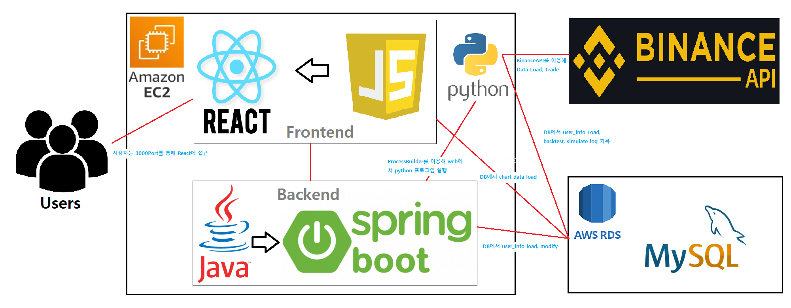
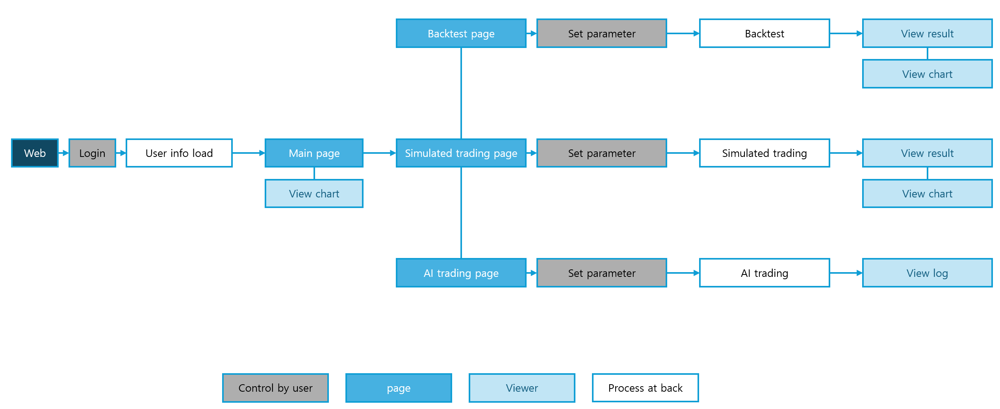
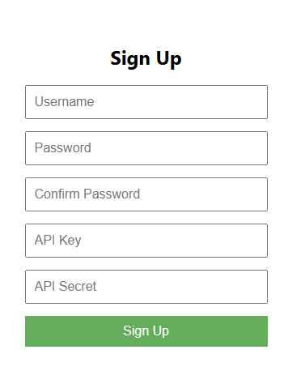
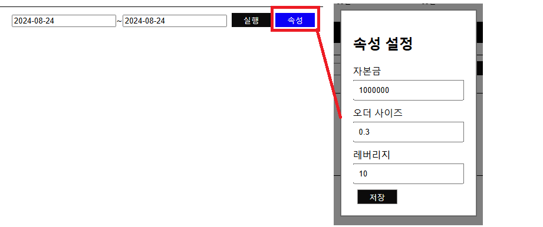
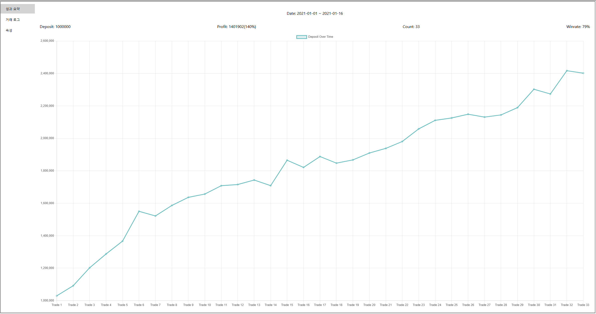
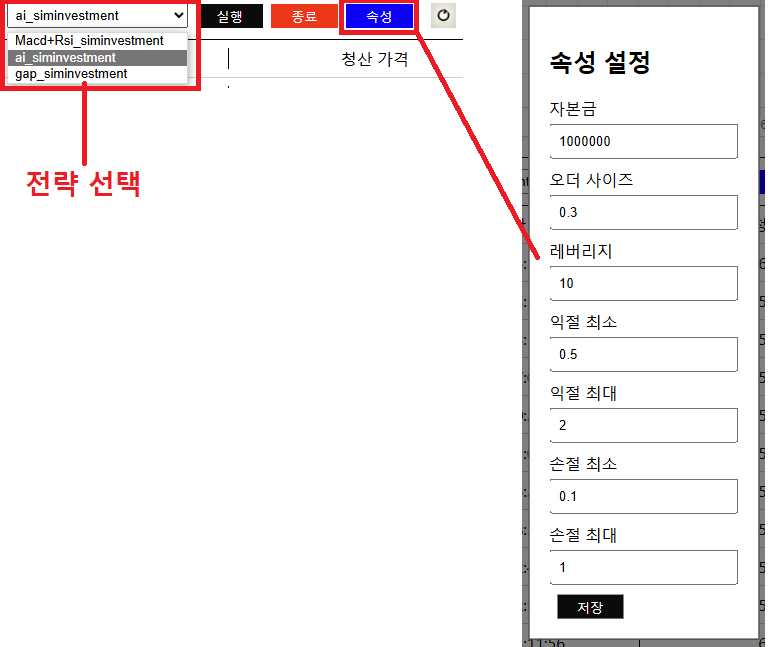
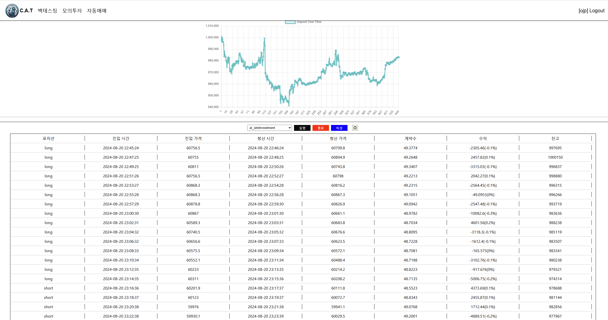

# Coin-AI-Trader
Coin AI Trader - 웹페이지를 통해 코인 투자 관련 여러 기능들을 사용하고, 프로그램을 통한 코인 트레이딩을 지원한다.

## 개발의도
- ### 주제 선정 배경
  - 암호화폐 시장의 급격한 성장
    - 최근 몇 년간 암호화폐 시장이 급격하게 성장했다. 많은 사람들이 암호화폐를 '투자 수단'으로 여기기 시작하였으며, 이에 따라 본격적으로 트레이딩을 시도하는 사람들이 늘고 있다.
  - 그에 비해 부족한 투자지식
    - 급격히 성장한 시장에 비해, 투자자들의 투자 지식은 부족한 상태이다. 한국은행의 조사에 따르면 대한민국 성인의 디지털 금융이해력은 OECD평균에 비해 상당히 낮은편이다(OECD평균 55점, 대한민국 43점). 기존 금융 시장과는 전혀 다른 디지털 금융 시장에 적응하지 못하고 있는 것이다.
- ### 필요성
  - 암호화폐 시장의 특수성에서 오는 필요성
    - 시장 거래 가능 시간이 정해져 있는 주식 시장과는 달리, 암호화폐 거래는 24시간 가능하다. 24시간동안 열려 있는 시장의 변동에 대응하기에는 휴식이 필요한 사람이 아닌 프로그램을 통한 트레이딩이 더욱 효율적이다.
- ### 기대효과
  - 효율적 투자
    - 수동으로 트레이딩을 하는 것은 준비는 물론 실행에도 많은 시간과 노력을 필요로 한다. 기존 주식시장과는 달리 24시간동안 거래가 가능한 암호화폐 시장은 이러한 점이 더욱 극대화된다. 프로그램을 통해 사용자들은 큰 노력 없이 시장의 움직임을 파악하고 효율적인 대처가 가능해진다.
  - 객관적 투자
    - 기존 주식시장보다 변동성이 더욱 강한 암호화폐 시장에서 감정을 억누르고 객관적으로 투자한다는 것은 어려운 일이다. 프로그램을 통한 자동매매 시스템은 감정을 배제하고 철저하게 데이터를 기반으로 한 매매를 수행하기 때문에 투자의 일관성, 정확성을 보장한다.

## 시연영상
https://youtu.be/lGs7OCejPG0

## 구조

## 사용
1. 웹사이트 접속 http://3.35.17.231:3000/
2. 회원가입, 로그인
   

3. 투자 기능 사용  
   1. 백테스팅  
   

   

   2. 모의 투자
   

   

   3. 자동 매매
   

